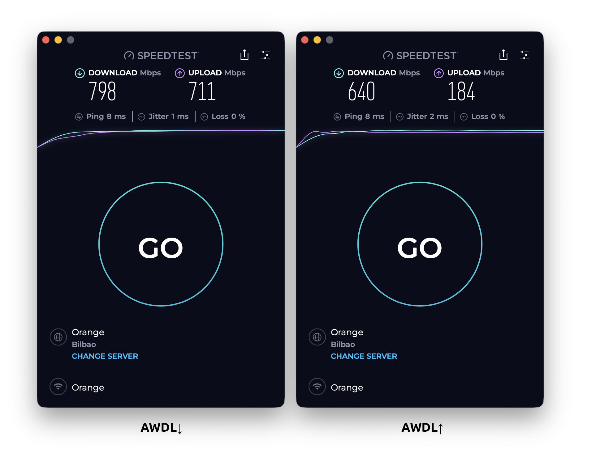

# AWDL Toggle

Menu bar app to control AWDL on macOS. Fixes slow/unstable Wi-Fi on Apple Silicon Macs.

## The Problem

AWDL (Apple Wireless Direct Link) powers AirDrop, AirPlay, Sidecar, and other Continuity features. On M1/M2/M3 Macs, it shares the Wi-Fi radio with your internet connection, causing:
- Ping spikes and jitter
- Reduced throughput (~400-500 Mbps vs ~700-800 Mbps with AWDL off)



## Why not just `ifconfig awdl0 down`?

You can run `sudo ifconfig awdl0 down` — but macOS will bring AWDL back up within seconds. Apple is *very* persistent: it tries to revive AWDL every 2-10 minutes, sometimes in rapid bursts of 2-3 attempts per second.

This app monitors AWDL and kills it every time macOS tries to bring it back. It keeps AWDL suppressed despite Apple's persistent attempts to revive it. And when you need AirDrop or AirPlay — one click to bring it back.

## Installation

```bash
curl -fsSL https://raw.githubusercontent.com/kryuchenko/AWDLToggle/main/install.sh | bash
```

Downloads, builds, and installs everything. Requires Xcode Command Line Tools.

The app isn't signed — signing requires an Apple Developer certificate ($99/year). This is a hobby project and I'd rather not pay Apple an extra hundred bucks annually just to fix their Wi-Fi issues.

## Usage

- Click the menu bar icon to see AWDL status
- **Block AWDL** — automatically disables AWDL whenever macOS tries to enable it
- **Allow AWDL** — instantly re-enables AWDL when you need AirDrop, AirPlay, Sidecar, or other Continuity features

The app lives in your menu bar. One click to block, one click to allow — switch in a second when you need to AirDrop something.

### Debug mode

Install with logging enabled to diagnose issues:

```bash
curl -fsSL https://raw.githubusercontent.com/kryuchenko/AWDLToggle/main/install.sh | bash -s -- --debug
```

Logs are written to `~/Library/Logs/AWDLToggle.log`. You can also enable/disable debug logging from the menu bar.

## Uninstall

Download and run `Uninstall AWDL Toggle.pkg` from [Releases](https://github.com/kryuchenko/AWDLToggle/releases), or manually:

```bash
killall AWDLToggle
launchctl unload ~/Library/LaunchAgents/com.local.awdltoggle.plist
rm ~/Library/LaunchAgents/com.local.awdltoggle.plist
sudo rm -rf /Applications/AWDLToggle.app
```

## Credits

Inspired by [awdlkiller](https://github.com/jamestut/awdlkiller) by @jamestut
